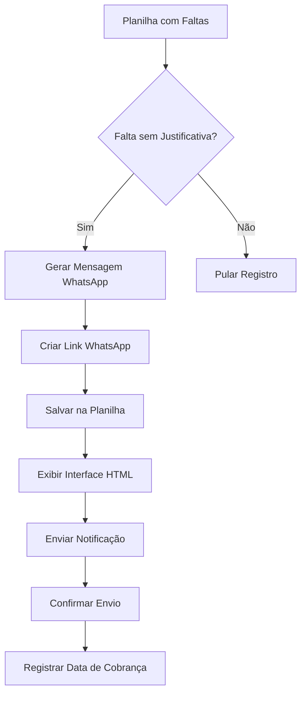

# 🏫 Sistema de Controle de Frequência Escolar

Sistema automatizado para controle de faltas escolares com notificações via WhatsApp, desenvolvido especificamente para instituições de ensino municipal.

## 📋 Descrição

O Sistema de Controle de Frequência Escolar é uma aplicação desenvolvida em Google Apps Script que automatiza o processo de cobrança de justificativas de faltas escolares. O sistema integra planilhas Google Sheets com notificações personalizadas via WhatsApp, proporcionando um controle eficiente da frequência dos alunos.

## ✨ Funcionalidades Principais

- 📱 **Notificações Automáticas WhatsApp**: Geração de links personalizados para envio de mensagens
- 📊 **Controle de Faltas**: Registro e acompanhamento de faltas não justificadas
- 🎯 **Interface Intuitiva**: Menu personalizado integrado ao Google Sheets
- 📝 **Registro Manual**: Funcionalidade para adicionar faltas manualmente
- 📄 **Relatórios em PDF**: Geração de relatórios individuais e consolidados
- ⚖️ **Conformidade Legal**: Sistema desenvolvido conforme Lei 9.394/96 (LDB)

## 🛠️ Tecnologias Utilizadas

- **Google Apps Script**: Backend e lógica principal
- **Google Sheets**: Armazenamento e gerenciamento de dados
- **HTML/CSS/JavaScript**: Interface web responsiva

## 📊 Estrutura da Planilha

### aba "registroFaltas"
| Coluna | Campo | Descrição |
|--------|-------|-----------|
| A | Mês | Mês da falta |
| B | Data da Falta | Data em que ocorreu a falta |
| C | Nome Completo | Nome completo do aluno |
| D | Telefone | Telefone do responsável |
| E | Turma | Turma do aluno |
| F | Turno | Turno regular da turma |
| G | Turno da Falta | Turno específico da falta |
| H | Justificativa | Justificativa apresentada |
| I | Motivo | Motivo da falta |
| J | Data Cobrança | Data da cobrança realizada |
| K | Link WhatsApp | Link gerado para WhatsApp |

### aba "dados"
| Coluna | Campo | Descrição |
|--------|-------|-----------|
| A | Nome do Aluno | Nome completo do aluno |
| B | Responsável | Nome do responsável |
| C | Telefone 1 | Telefone do responsável |
| D | Telefone 2 | Telefone do responsável |
| E | Turma | Código/Nome da Turma |
| F | Email | Email do responsável |
| G | Status | Aluno Ativo/Inativo |


## 🚀 Instalação e Configuração

### Pré-requisitos
- Conta Google (Gmail)
- Acesso ao Google Sheets
- Permissões do Google Apps Script

### Passo a Passo

1. **Criar Nova Planilha Google Sheets**
   ```
   - Acesse: https://sheets.google.com
   - Crie uma nova planilha
   - Renomeie para "XXXXXXXXXX"
   ```

2. **Configurar Abas da Planilha**
   - Crie aba "registroFaltas" com estrutura descrita acima
   - Crie aba "dados" com informações dos alunos e responsáveis

3. **Instalar o Google Apps Script**
   ```
   - Na planilha: Extensões > Apps Script
   - Cole o código principal
   - Salve o projeto
   ```

4. **Configurar Permissões**
   - Execute a função `onOpen()` uma vez
   - Autorize as permissões solicitadas
   - Verifique se o menu personalizado apareceu

## 💻 Como Usar

### 1. Notificar Responsáveis
- No menu: `🏫 Sistema de Frequência Escolar` > `📱 Notificar responsáveis`
- O sistema processa automaticamente faltas não justificadas
- Interface HTML será exibida com links WhatsApp gerados
- Clique nos links para enviar notificações individuais

### 2. Registrar Faltas
- No menu: `🏫 Sistema de Frequência Escolar` > `➕ Registrar Faltas`
- Preencha os dados da falta no formulário
- Os dados serão salvos automaticamente na planilha

### 3. Gerar Relatórios
- No menu: `🏫 Sistema de Frequência Escolar` > `📊 Gerar Relatório`
- Selecione o tipo de relatório desejado
- PDF será gerado automaticamente

## 🔄 Fluxo de Processamento



## 📱 Tipos de Mensagem

### Turma Regular
```
Prezado(a) [Nome do Responsável],

Informamos que [Nome do Aluno] apresentou falta não justificada 
no dia [Data da Falta].

Solicitamos gentilmente que apresente a justificativa no prazo 
de 30 dias, conforme legislação vigente.

EMEI [Nome da Escola]
```

### Turma Integral
```
Prezado(a) [Nome do Responsável],

Registramos que [Nome do Aluno] apresentou falta no período 
[Turno] em [Data da Falta].

Para turmas integrais, é necessário justificar todas as 
ausências conforme regimento interno.

EMEI [Nome da Escola]
```

## ⚖️ Conformidade Legal

O sistema opera em conformidade com:
- **Lei Federal 9.394/96 (LDB)**: Lei de Diretrizes e Bases da Educação
- **Estatuto da Criança e do Adolescente (ECA)**
- **Regimentos Internos Municipais**
- **LGPD**: Proteção de dados pessoais

## 🔒 Segurança e Privacidade

- ✅ Dados armazenados exclusivamente no Google Sheets
- ✅ Acesso restrito a usuários autorizados
- ✅ Não utiliza APIs externas para dados pessoais
- ✅ Logs de auditoria para todas as ações
- ✅ Backup automático via Google Drive

## 🛡️ Tratamento de Erros

O sistema possui tratamento robusto de erros:
- Validação de dados de entrada
- Verificação de planilhas obrigatórias
- Formatação automática de telefones
- Logs detalhados para debugging
- Feedback visual para o usuário

## 📈 Estatísticas e Relatórios

### Métricas Disponíveis
- Total de notificações geradas
- Notificações por tipo de turma
- Taxa de resposta dos responsáveis
- Relatórios mensais e anuais

### Exportação de Dados
- Relatórios em PDF
- Exportação para Excel
- Dados históricos preservados

## 🔧 Personalização

### Customizar Mensagens
```javascript
// Edite as funções criarMensagemRegular() e criarMensagemIntegral()
function criarMensagemRegular(nome, primeiroNome, data, responsavel) {
  return `Sua mensagem personalizada aqui...`;
}
```

### Alterar Layout da Interface
```css
/* Modifique o CSS dentro da função criarInterfaceHTML() */
.container { 
  /* Suas customizações aqui */
}
```

## 🐛 Solução de Problemas

### Problema: Menu não aparece
**Solução**: Execute manualmente a função `onOpen()` no Apps Script

### Problema: Erro de permissões
**Solução**: Reautorize o script em `Extensões > Apps Script > Autorizações`

### Problema: Links WhatsApp não funcionam
**Solução**: Verifique formato dos telefones (deve conter código do país)

### Problema: Interface não carrega
**Solução**: Verifique se há dados na planilha "registroFaltas"

## 📞 Suporte

Para suporte técnico:
1. Verifique a seção "Solução de Problemas"
2. Consulte os logs no Google Apps Script
3. Entre em contato com o administrador do sistema

## 🤝 Contribuições

Para contribuir com o projeto:
1. Faça fork do repositório
2. Crie uma branch para sua feature
3. Commit suas mudanças
4. Abra um Pull Request

## 📄 Licença

Este projeto está licenciado sob a licença MIT - veja o arquivo [LICENSE](LICENSE) para detalhes.

## 🏗️ Arquitetura do Sistema

```
Sistema de Frequência Escolar/
├── Google Apps Script/
│   ├── Código Principal (Code.gs)
│   ├── Funções de Mensagem
│   ├── Interface HTML
│   └── Funções de Relatório
├── Google Sheets/
│   ├── Aba "registroFaltas"
│   ├── Aba "dados"
│   └── Configurações
└── Recursos/
    ├── Templates de Mensagem
    ├── Estilos CSS
    └── Scripts JavaScript
```

## 🔄 Versionamento

- **v1.0**: Versão inicial com funcionalidades básicas
- **v2.0**: Interface melhorada e novos relatórios
- **v2.1**: Correções de bugs e otimizações

## 📊 Métricas de Performance

- ⚡ Processamento: < 5 segundos para 100 registros
- 💾 Armazenamento: Ilimitado via Google Sheets
- 🔄 Disponibilidade: 99.9% (Google Cloud)
- 👥 Usuários simultâneos: Até 100

---

## 📝 Changelog

### v2.0 - Atual
- ✅ Interface HTML redesenhada
- ✅ Suporte a turmas integrais
- ✅ Relatórios em PDF
- ✅ Melhor tratamento de erros

### v1.0 - Inicial
- ✅ Funcionalidade básica de notificações
- ✅ Integração com WhatsApp
- ✅ Menu personalizado

---

**Desenvolvido para instituições de ensino brasileiras** 🇧🇷

*Sistema em conformidade com a legislação educacional vigente*
